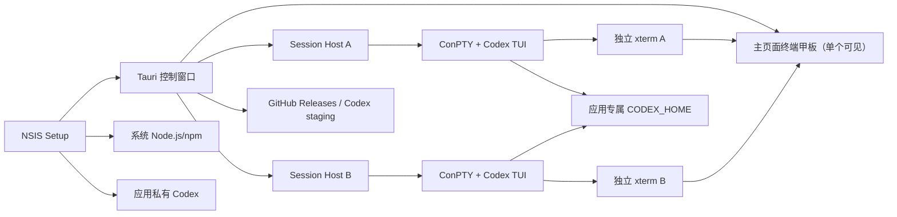

# Windows x64 Codex 桌面封装方案

Status: Accepted
Kind: Decision
Decision ID: DEC-0001
Scope: tauri-codex / 首个交付技术方向
Owner: 项目维护者
Updated: 2026-08-10
Depends On:
- ../产品契约.md

本文固定用户已确认的首个交付技术方向。它不是发布授权；实现事实以源码、类型和测试为准。

## 结论

采用“NSIS x64 Setup + 唯一 Tauri 主窗口 + 主页面嵌入的 xterm 终端甲板 + 每会话独立 Session Host + ConPTY + 内置 Codex TUI”的结构。会话内容、审批、slash 命令、历史选择和生命周期全部由 Codex TUI 原样呈现，应用不再使用 app-server 重建聊天界面。

平台支持 Windows 10 22H2 x64 和 Windows 11 x64。实现只选择两者共同支持的 Win32、WebView2 和进程管理能力，不引入 Windows 11 专属路径。

“应用不挂”定义为故障隔离和可恢复控制面：单个 TUI 会话卡死、退出或产生大量输出时，主窗口和其他会话仍可操作，用户仍可中断并强制清理该进程树；不承诺 Codex、网络、用户命令或整机资源耗尽永不失败。

## 决策表

| 决策 | 已确定方案 | Owner | 依据 |
|---|---|---|---|
| Windows 平台 | Windows 10 22H2 x64 与 Windows 11 x64 共用实现路径 | Installer 与桌面应用 | 用户决定 |
| 安装入口 | NSIS per-machine Setup 安装应用和基线 Codex，并在 post-install bootstrap 中复用或安装系统 Node.js/npm | Setup | 安装程序职责 |
| Codex 所有权 | 基线与更新版 Codex 都位于应用私有目录，不安装或搜索系统全局 Codex | Updater | 产品不变量 |
| 会话界面 | 主 Tauri 窗口内嵌终端甲板；每个会话持有独立 xterm，任一时刻只显示当前选中的一个 | Tauri 前端 | 用户最新决定 |
| 新会话 | 控制窗口启动无子命令的内置 `codex`；第一条用户输入由 Codex 创建 session | Codex TUI | 原生 CLI 行为 |
| 历史恢复 | 控制窗口以用户明确选定的模型实例启动内置 `codex resume` 原生选择器；未选定实例不启动 | Codex TUI | session 归 Codex 所有 |
| session 所有权 | Codex 负责创建、命名、持久化、恢复、fork、归档和删除；应用不保存 thread id | Codex | 用户决定 |
| 多任务并发 | 每个会话必须独立运行 Session Host、ConPTY、xterm 和内置 Codex 进程树；应用不设数量上限 | Tauri Rust runtime 与前端 | 用户决定，硬门禁 |
| 故障隔离 | Session Host 独立运行；停止超时后按 PID 清理整棵进程树 | Tauri Rust runtime | 控制窗口不可被单任务拖死 |
| 输出压力 | Session Host 和对应嵌入 xterm 之间使用有界队列与逐批渲染确认；过载只影响对应会话 | Tauri Rust runtime 与 xterm | 防止终端输出洪泛 |
| 模型实例 | 每个 Responses API 实例保存名称、URL、API Key 和唯一默认标记，并生成不含 model 的独立 `<profile>.config.toml` | 配置层与 Codex | 用户决定与 Codex 0.134+ 配置规则 |
| 配置隔离 | 所有 Codex 进程显式使用同一个应用专属 `CODEX_HOME` | Tauri Rust runtime | 用户决定与官方能力 |
| 更新 | 桌面资产来自 GitHub Releases；Codex 在应用私有 staging 验证并切换；所有 TUI 归零后激活 | Tauri updater 与 Setup | 用户决定 |

## 运行结构

## 职责边界

### NSIS Setup

- 安装 Tauri 主程序、基线 Codex 和 Node.js LTS x64 备用安装介质；WebView2 使用 Tauri 安装器的 bootstrapper 行为。
- 安装完成后运行无界面 runtime bootstrap：复用合格系统 Node.js/npm，缺失或版本不足时静默安装官方 Node.js LTS，再重新探测。
- 不把 Codex 安装到系统全局 npm，也不承担运行时 session 管理。

### Tauri 主窗口与嵌入终端

- 主窗口是唯一产品窗口。会话视图提供工作目录、精确模型实例选择、“新会话”和“恢复会话”；左侧会话目录按工作目录分组显示当前运行实例，组标题使用路径最后一级目录名，选择实例后在主页面内显示对应 xterm。
- “新会话”使用所选工作目录和明确选定的模型实例启动 `codex`；未选定实例时不启动，选择实例时只为该进程传 `--profile` 与对应环境变量。
- “恢复会话”使用所选工作目录和明确选定的模型实例启动 `codex resume`；默认标记只帮助用户识别和预选，不提供隐式默认覆盖。Codex 原生选择器仍负责选择和恢复 session。
- 返回会话启动器或切换模型实例/设置只隐藏当前 xterm，不停止运行链；主窗口不读取历史 session、不显示聊天转录、不解释 TUI 控制序列，也不保存 session 标识。
- 设置视图管理 Codex 官方常用字段和高级 TOML；模型实例视图管理名称、URL、API Key 和默认标记。

### Session Host 与嵌入终端

- 每个会话必须一一对应一个独立 Session Host、一个 ConPTY、一个独立 xterm 和一个内置 Codex 子进程及其后代进程树；禁止共享或复用这些运行组件。
- Session Host 固定系统 Node 路径、应用 Codex 路径、工作目录和应用专属 `CODEX_HOME`，并把 ConPTY 字节原样转发给该会话的 xterm。
- 输入、窗口 resize、Ctrl+C 和 Codex 原生快捷键直接通过 ConPTY；应用不识别消息、命令、审批或最终答案。xterm 对系统剪贴板图片粘贴只做事件捕获并转发 `Ctrl+V`，图片读取、临时 PNG 和附件状态由内置 Codex TUI 负责。
- Session Host 输出进入有界队列；对应 xterm 每批渲染后回传确认。队列或确认超时只将对应会话标记为输出过载，不阻塞主窗口或其他会话。
- 用户停止时先发送 Ctrl+C；无响应时由 Job Object 或 PID 进程树清理兜底。

## session、配置与密钥

Codex TUI 是 session 和聊天显示的唯一所有者。应用不使用 app-server，不建立数据库、转录副本、持久索引或自定义恢复状态，也不读取 rollout 或其他内部 session 文件。

所有 Codex TUI 共享应用数据目录中的 `CODEX_HOME`。每个模型实例使用独立的 `CODEX_HOME/<profile>.config.toml`，文件以顶层 `model_provider` 选择同文件内的 custom provider；主 `config.toml` 不保留应用管理的旧式 `[profiles.server-*]` 或 `[model_providers.server-*]`。模型实例 API Key 保存在本机应用数据中的 Server 配置，并只通过对应 profile 的 `env_key` 注入新 TUI 进程；仓库、样例和事件不得包含真实密钥。OpenAI 登录、审批和其他认证方式继续由 Codex 负责，产品不增加账号或安全体系。

## 更新状态

更新状态为 `idle → checking → available → staging → verifying → waiting-instances → activating → ready`，失败为 `failed`。

- 应用启动后及运行期间默认周期检查更新；自动检查发现新版本后自动下载、验证并暂存桌面 Setup 或 Codex。
- 用户点击对应更新动作后才激活桌面 Setup 或 Codex `current`；该动作不自动结束活动 TUI。
- 任何正在启动或运行的 Session Host 都会阻止 Codex 和桌面更新激活。
- 所有 TUI 归零后，控制进程重新验证 Codex staging 和 Node 条件，再切换 Codex `current`；提交前失败不改变旧版本。
- 桌面程序更新通过已下载的新版 NSIS Setup 完成，不由运行中的控制窗口覆盖自身文件。

## 实施准入

- “新会话”打开真实 Codex TUI；用户发送第一条消息后由 Codex 在应用专属 `CODEX_HOME` 创建 session。
- “恢复会话”打开 Codex 原生 session 选择器，选择后可继续完整历史。
- TUI 中的消息、命令、工具、审批、快捷键、进度、最终结论和耗时不经应用转换即可使用。
- 多个 TUI 可以同时执行，界面不存在硬编码数量拒绝；切换可见 xterm 不停止其他会话。
- 单 Session Host 卡死、退出或大量输出时，主窗口和其他 TUI 继续响应；停止超时后能清理该进程树。
- 更新在任何 TUI 启动或运行期间只进入等待，全部归零后才能激活。
- Windows 10 22H2 x64 与 Windows 11 x64 使用相同代码路径。

## 非目标

- 不提供应用自建的持久历史 session 树、应用自有聊天 UI、同页多会话分屏（终端甲板只显示当前选中的 xterm）、聊天转录缓存、自动任务重放或应用级并发上限；左侧目录只是当前运行实例的内存投影。
- 不使用 app-server、`codex exec --json` 或 Responses API 事件自行重建 Codex 交互。
- 不支持系统全局 Codex、产品账号系统、macOS、Linux 或 Windows ARM64。
- 不保证整机资源耗尽时其他任务仍实时响应。

## 证据

- 官方 Codex CLI 参考：无子命令的 `codex` 启动交互式 TUI；`codex resume` 使用原生 session 选择和恢复能力。
- 当前源码的 Session Host、ConPTY、Job Object、输出背压和 xterm 终端窗口。
- OpenAI Codex 配置参考：`CODEX_HOME`、profiles、custom providers、`env_key` 和 Responses provider。
- npm registry 元数据：内置 `@openai/codex` 的 Node 入口、Windows x64 optional dependency 和 Node engine 范围。
- Here 参考项目：安装程序、更新协调与运行程序职责分离；本项目复用职责边界，不复制其产品结构。

## 发布与官方文档获取边界

- 桌面发布只需要在项目 GitHub Releases 放置 Windows x64 安装资产。
- 官方 Codex 文档查询使用工作区 skill [official-codex-docs](../../../../.agents/skills/official-codex-docs/SKILL.md)，保留 `developers.openai.com` 官方 URL；Windows helper 依次使用显式 `CODEX_DOCS_PROXY`、`localhost:1080`、`127.0.0.1:1080`，最后直连 HTTPS。
- 该代理只用于开发资料抓取，不注入应用、Codex、更新器或用户会话。
