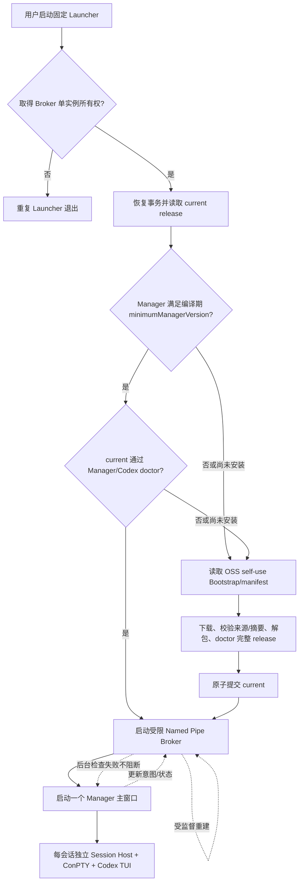
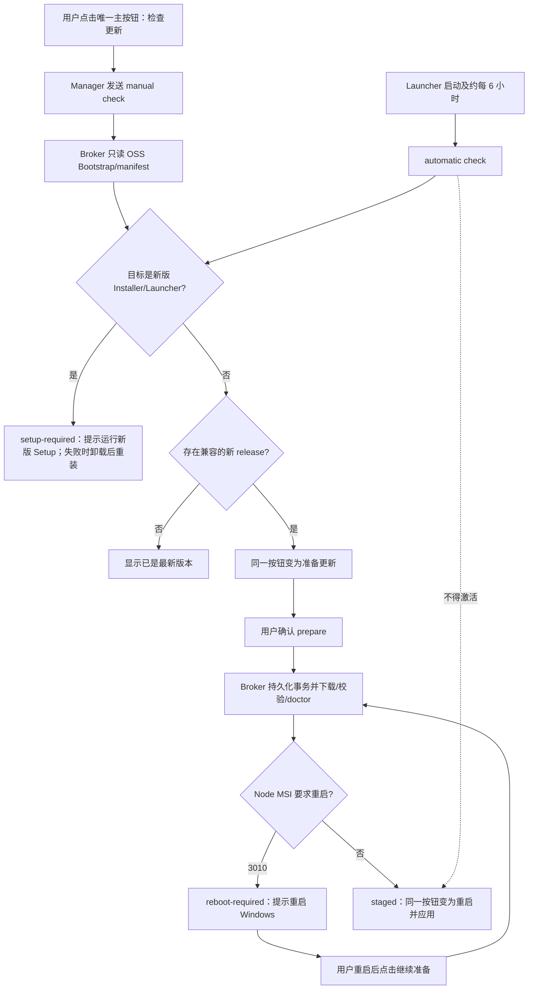
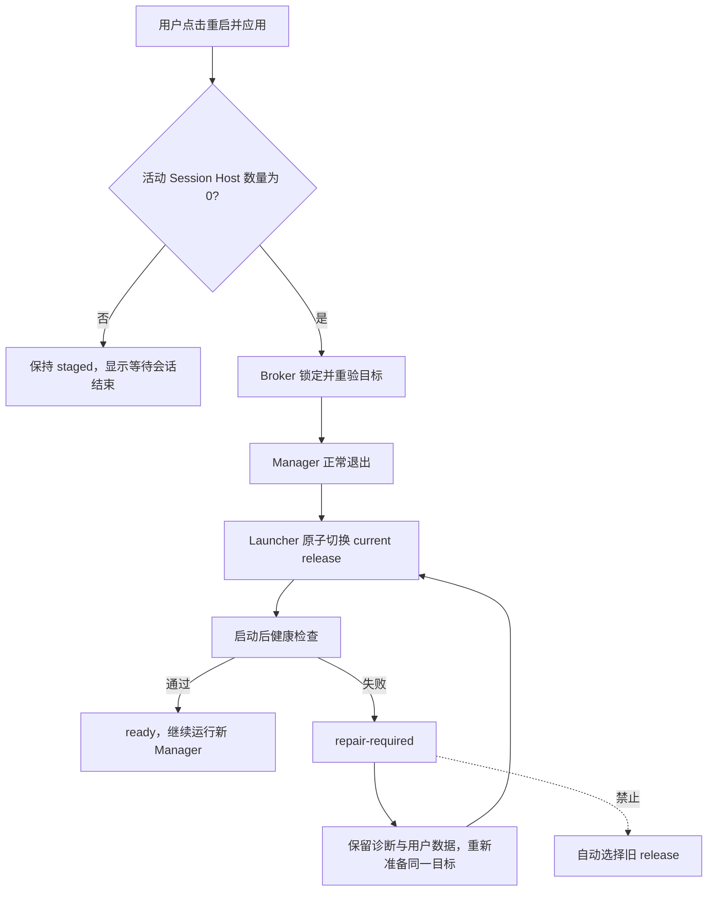

# tauri-codex 当前设计

Status: Active
Kind: CurrentDesign
Scope: tauri-codex / Windows x64 客户端交付与更新控制面
Owner: 项目维护者
Updated: 2026-08-15
Depends On:
- 产品契约.md
- 决策/DEC-0001-Windows-x64-Codex桌面封装方案.md

本文是客户端交付与更新能力的唯一当前设计。Session Host、ConPTY、xterm、Codex TUI 与 `CODEX_HOME` 的会话设计继续由产品契约、DEC-0001 和源码共同约束。

## 设计结论

- 固定 OSS 根 `https://shared-public-assets.oss-cn-beijing.aliyuncs.com/project-tauri-codex/` 是 Installer、Bootstrap、manifest、Manager、Codex 和 Node fallback 的唯一二进制读取源。GitHub 只保存源码、tag、Release Notes 和 OSS 下载链接，不附加二进制资产。
- NSIS 是 per-machine 薄安装器，因为缺失 Node.js 时需要安装系统级官方 Node.js LTS。它只负责 Launcher、Bootstrap seed、图标、快捷方式、注册、修复、升级和卸载。
- Launcher 是唯一 Updater。它只接受 schema v3 且显式声明 `releaseMode: self-use` 的 Bootstrap/manifest，准备整个 Manager/Codex/Node release，持久化一笔类型化事务，完成原子激活和启动健康检查。
- Launcher 在读取事务、恢复激活、访问网络或改变安装状态前，必须先取得跨进程单实例所有权；未取得所有权的重复进程直接退出。
- Launcher 启动 Manager 后保持为无窗口 Broker。Manager 只能通过当前用户 DACL 限制且拒绝远程客户端的 Windows Named Pipe 查询状态和提交 `check`、`prepare`、`activate`、`cancel` 意图。
- Manager 只拥有可见状态、用户确认和活动会话 drain；不得下载、解包、安装、替换文件或解析发布目录。
- Manager、Codex 和 Node compatibility 由一个 release manifest 共同决定。Codex 不再拥有独立 `current`、staging、npm 查询或 npm 安装路径。
- 激活失败采用 `forward-repair`。旧 release 可以作为未引用诊断材料保留，但不得写入 `previous` 或自动回滚；Launcher 只修复目标 release。
- 本次直接切换到 schema v3 self-use，不保留 schema v1/v2、GitHub fallback 或旧 Launcher 桥接。已安装旧版本不会被新协议自动接管，应用内检查只进入 `setup-required`；用户必须运行新版 Setup，正常升级失败时可卸载后重装，设置、应用专属 `CODEX_HOME` 和用户数据保持不变。

## 所有权

| Owner | 拥有 | 禁止拥有 |
|---|---|---|
| NSIS Installer | 首装、Launcher 升级、系统级 Node prerequisite、注册、快捷方式、修复和卸载 | release 选择、Manager 会话、运行时更新状态 |
| Launcher/Broker | Bootstrap/manifest、self-use 来源策略与摘要、第三方包闭包与 Authenticode、组件准备、事务、激活、健康检查、forward-repair、Manager 进程生命周期 | 产品配置、Codex session、模型实例和用户数据 |
| Manager | 更新页面、用户意图、活动会话计数、激活确认 | 网络下载、解包、目录扫描、文件切换、安装器执行 |
| Session Host | 单会话 ConPTY、Codex 进程树、输入输出背压 | 更新和 release 选择 |
| 发布脚本 | 单次 self-use 候选、冻结来源身份、不可变对象、匿名回读、最后提交 Bootstrap | 运行时状态和目标机器数据 |

## 公开协议

Bootstrap 与 release manifest 均使用 schema v3 self-use envelope：

```text
{ schemaVersion: 3, releaseMode: "self-use", payload }
```

`releaseMode` 是当前发布协议的显式策略边界；Launcher 只接受 `self-use`，不会把缺少字段或未来生产模式当成自用模式。Bootstrap 指向精确 Installer 与 manifest object key；manifest 是 Manager、Codex 和 Node component closure 的唯一所有者。每个 artifact 都包含 `objectKey`、`size`、`sha256` 和 provenance，Manager/Codex 组件还必须包含 `installedTreeSha256`。构建端按规范化相对路径、文件大小和文件 SHA-256 计算确定性安装树摘要，运行时对 staging 与 installed 目录直接复算；组件 ZIP 缓存可以缺失，不属于启动或健康检查依赖。运行时只拼接固定 OSS 根与精确 object key，不列目录、不猜文件名、不回退其他源。

tauri-codex 自有 Launcher、Manager 和 NSIS Installer 使用 `unsigned-self-use+sha256`，不要求 Authenticode；Bootstrap/manifest 使用 `self-use+sha256`。Codex 使用 `upstream-package+sha256`：构建候选和运行时 doctor 都要求固定上游包版本、当前版本精确的五文件 Windows executable 闭包和安装树摘要，并对其中四个具备签名的 OpenAI 可执行文件执行 WinVerifyTrust；上游包内 `codex-path/rg.exe` 没有 Authenticode，只能在该精确闭包内由组件摘要和 doctor 接受。Node 使用 `upstream-authenticode+sha256`，WebView2Loader 也必须通过上游 Authenticode。self-use 依赖固定 HTTPS OSS、不可变 object key、size/SHA-256、安装树摘要、匿名回读和冻结 source commit 保证完整性与可追溯性，但不声称提供发布者身份担保。未来生产通道必须新增独立 release mode、凭据和验证协议，不能复用 self-use 放宽规则。

`minimumManagerVersion` 由 Installer 版本元数据持有，表示当前 Launcher/Manager IPC 与 release 协议的最低兼容 Manager 版本，不是目标 release 版本。普通 Manager 版本发布不得抬高该值；协议发生不兼容变化时必须先发布新版 Installer/Launcher。运行中的 Manager/Broker 只报告 `setup-required`，不下载、暂存或执行 Installer。外部运行新版 Setup 后，新 Launcher 在启动现有 Manager 前检查该下限，不满足时进入正常 setup/bootstrap 准备兼容 release。Launcher 不执行旧协议 compatibility bridge。

## 启动流程



健康且满足编译期 Manager 版本门禁的 `current` 启动关键路径不读取远端 Bootstrap/manifest。Named Pipe 首次 ready 后仍由 Launcher 监督，运行期退出时记录错误并延迟重建；自动检查失败只更新事务错误，不终止已启动 Manager。

## 检查与暂存流程



手动 `check` 不创建组件、staging 或安装动作。自动检查只可准备兼容 release；Installer/Launcher 目标同样停在 `setup-required`。自动准备不退出 Manager、不激活、不结束会话，也不自动重试 `reboot-required`。Node MSI 返回 3010 表示安装成功但必须重启，不归类为失败；重启后只由用户触发继续准备。前台主操作和取消操作互斥并同时禁用；UI 轮询 Broker 的同一事务快照，旧响应不得覆盖新事务。

## 激活与恢复流程



活动会话只在 Manager 内存中计数，不写入交付事务。激活请求必须携带当前活动数，Manager 与 Broker 都拒绝非零值。事务、激活 journal 和 `current.json` 以唯一临时文件、`sync_all` 和 write-through 原子替换写入应用数据目录；Broker 只有在持久化成功后才替换内存事务，后台保存失败必须在内存快照中可观察。状态只能沿类型化转换前进，失败保存 phase、component、target 和错误，不通过目录扫描推断。

## 事务状态

```text
idle -> checking -> up-to-date | available | setup-required
available -> downloading -> verifying -> staged
downloading -> reboot-required -> downloading
staged -> waiting-for-drain -> activating -> health-check -> ready
any in-flight state -> failed
activating | health-check -> repair-required -> downloading
```

`manual` 与 `automatic` 是 check trigger，不是状态字符串。目标是 `release` 或 `installer` 的 tagged enum，不用 `installer@version`；`installer` 目标只产生 `setup-required`，不能进入 prepare、staging 或 activation。只允许一个进行中的事务；重复意图返回同一事务或明确 busy，不并行修改 staging/current。

## 文件边界

- `app/src-tauri/src/delivery/contract.rs`：v3 self-use envelope、Bootstrap、manifest、版本、object key 与按角色限定的 provenance。
- `delivery/component.rs`：OSS exact-read、size/SHA-256、安全解包、安装树摘要、Node 安装和组件 doctor；缓存只用于下载复用，不参与 installed 健康判定。
- `delivery/transaction.rs`：类型化持久事务与原子写入。
- `delivery/ipc.rs`：Broker 单实例所有权、当前用户 Windows Named Pipe 协议与可重启服务入口。
- `delivery/takeover.rs`：Installer 升级前的产品进程枚举、正常关闭、五秒等待与安装根路径复验终止。
- `delivery/broker.rs`：唯一更新编排、自动检查、Manager 生命周期。
- `delivery/activation.rs`、`health.rs`：current、Authenticode/doctor、forward-repair。
- Manager 的 Tauri command 只做 IPC adapter；前端只消费 `DeliverySnapshot`。

## 失败边界

- OSS、来源策略、Codex 可执行闭包、要求的第三方 Authenticode、digest、size、schema、platform、architecture、compatibility、safe path 或 doctor 任一失败都不能改变 `current`。
- Broker 不可达时更新页显示可诊断错误，会话功能继续使用已启动 release；Manager 不自行接管更新。
- 远端 Bootstrap/manifest 不可达时，健康 `current` 和 Manager 启动不受影响；后台检查只进入可重试失败状态。
- health check 失败后不删除用户配置、`CODEX_HOME` 或会话数据，不自动回滚。
- 不创建 Service、计划任务、第二窗口、第二 binary origin 或产品级凭据系统。
